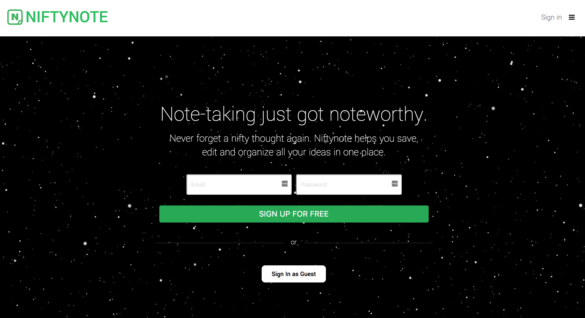
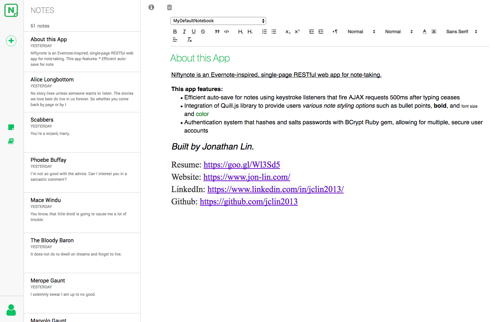
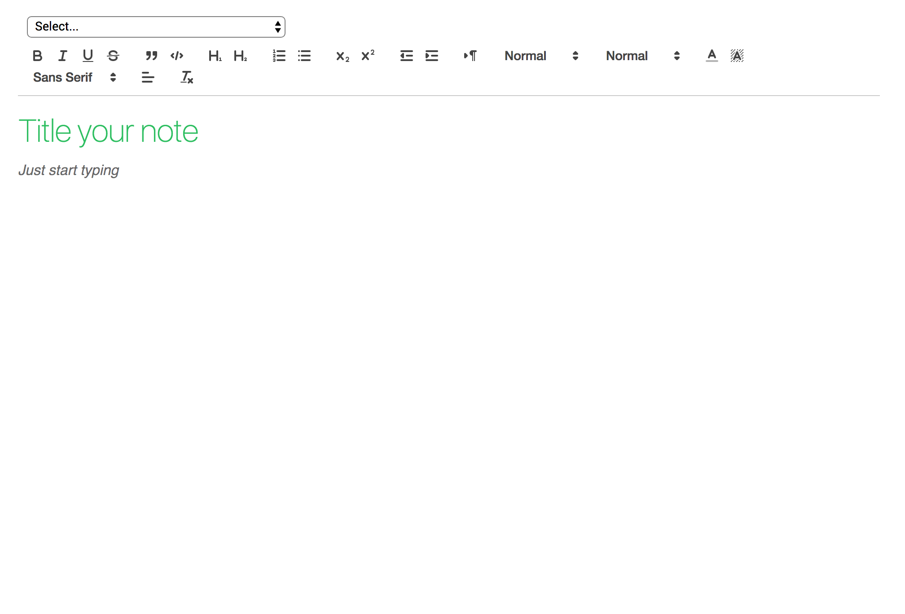
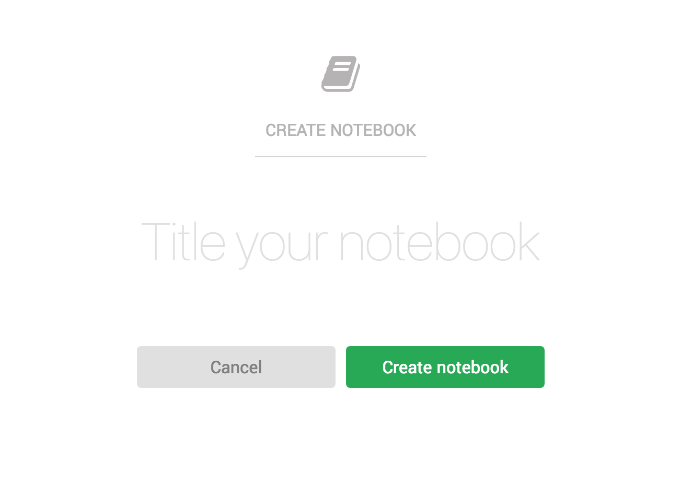
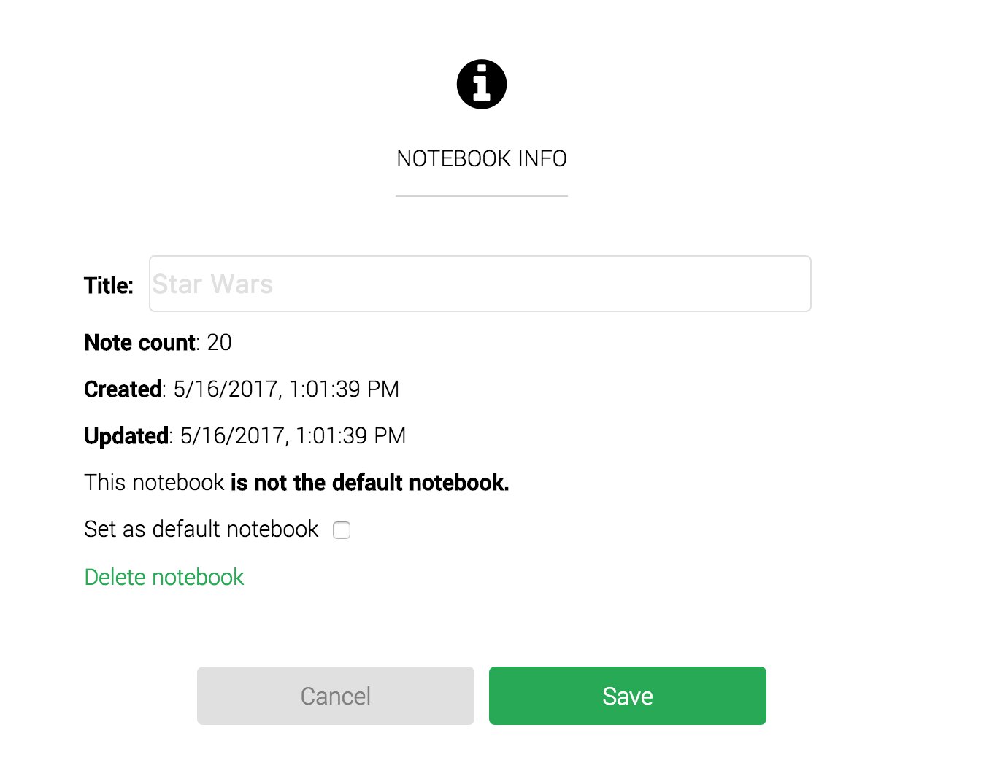

# Niftynote
* [Live link](https://niftynote.herokuapp.com)

### Background

Built with Rails on the backend and React/Redux on the frontend, Nifynote is an Evernote-inspired, single-page RESTful web app for note-taking.

### Highlights
* Efficient auto-save for notes
* Rich-text editing
* New account creation, user login and guest login
* Users can organize notes in notebooks and/or tags

### Also Built With:
* Ruby
* JavaScript
* jQuery
* HTML5
* CSS3
* ActiveRecord

### Screenshots

